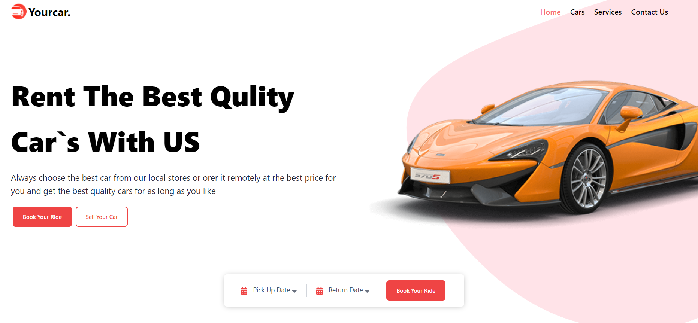
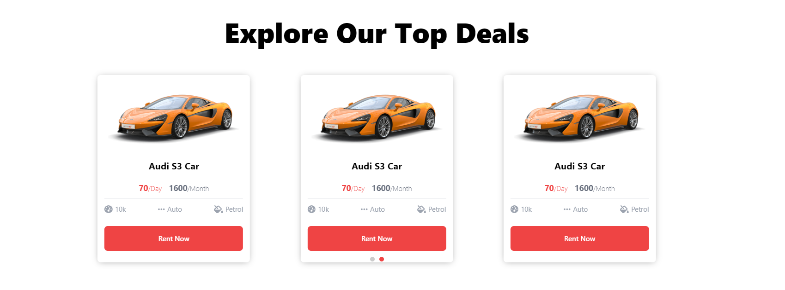
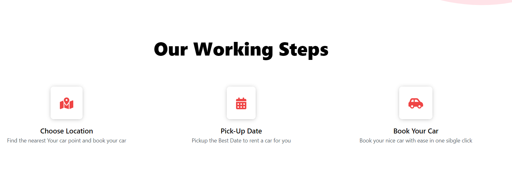
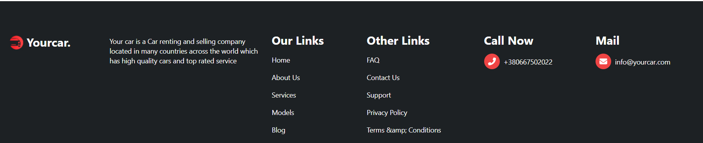

## Car App
# [Demo](mern-website-sigma.vercel.app)

### Main

### Swiper 

### Our Working Steps 

### Footer 


### What's included
| Name             | Description   |
| :-------------:|--------------|
| [React](https://reactjs.org/) |  Build Web Apps using JavaScript and React. |
| [React Redux](https://react-redux.js.org/) |React Redux is maintained by the Redux team, and kept up-to-date with the latest APIs from Redux and React.|
| [Swiper](https://swiperjs.com/) |It is a modern touch slider which is focused only on modern apps to bring the best experience and simplicity.|
| [Styled Components](https://styled-components.com/) |This lets you write actual CSS in your JavaScript| 
| [twin.macro](https://github.com/ben-rogerson/twin.macro) | Twin blends the magic of Tailwind with the flexibility of css-in-js at build time. |
| [Typescript](https://www.typescriptlang.org/) | TypeScript is a strongly typed programming language that builds on JavaScript, giving you better tooling at any scale.  |

### Installation

Clone this repo

```sh
$ git clone git@github.com:zazazaza4/Car_Website.git
$ cd Car_Website
$ yarn install or npm install
```
